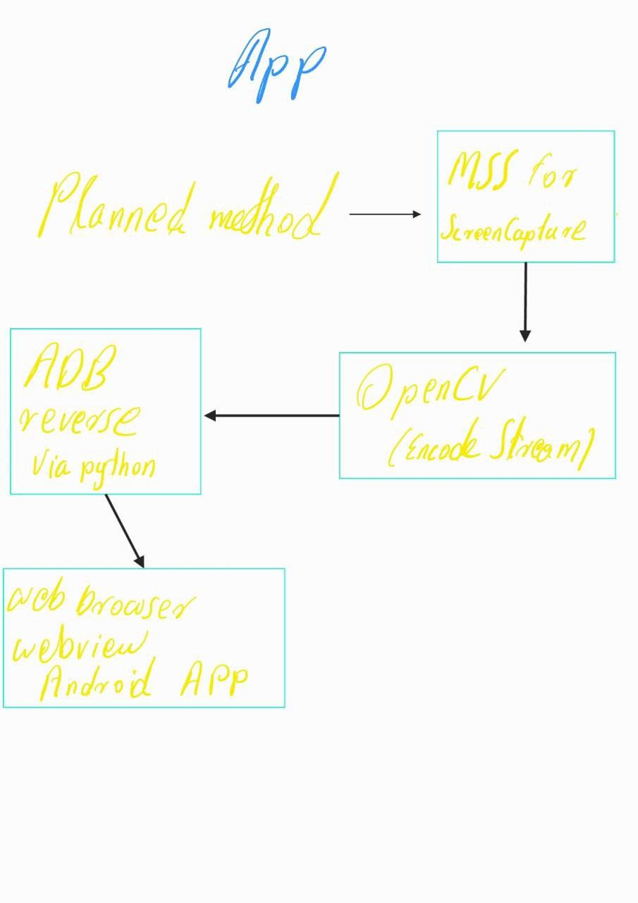

# USB Display Streamer

A lightweight project to mirror your PC screen to your phone via **USB**, built for creators and tinkerers who want control — without the high price tag.

##  Purpose

While editing videos, I ran into a big issue — color grading on my LCD monitor looked totally different on my phone's OLED screen. I needed an affordable way to **preview and color grade directly for my phone display**.

Most apps out there are either:
- **Too expensive**, or  
- **Not tailored** to my workflow

So I built my own.

## Project Milestones

- **Goal #1**: Stream PC screen to phone over USB  
  ✅ *Completed on 15/06/25*

## 🔁 Flowchart



## Setup Instructions

1. **Clone this repository**
   ```bash
   git clone https://github.com/sicxbit/usb-display-streamer.git
   cd usb-display-streamer 
   ```

2. **Install the dependancies**
    ``` 
    pip install -r requirements.txt 

    ```
3. **Run the script**
    ```
    python run.py
    ```

## ⚠ ADB Dependency

ADB is required but **not bundled** due to licensing.

Please do one of the following:
1. [Download ADB from Google's official page](https://developer.android.com/studio/releases/platform-tools)
2. Place `adb.exe` inside the `adb/` folder, OR
3. Set an environment variable pointing to your ADB:
   ```bash
   export ADB_PATH="C:/path/to/adb.exe"
